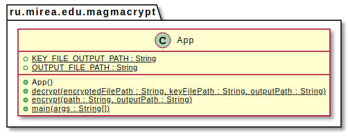
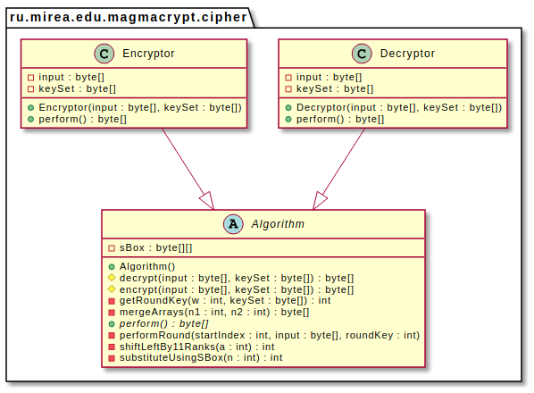
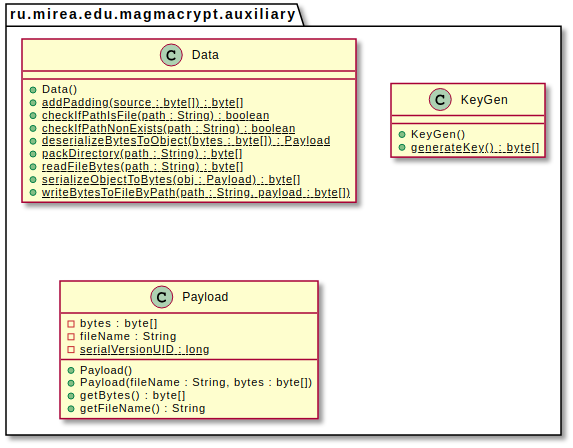
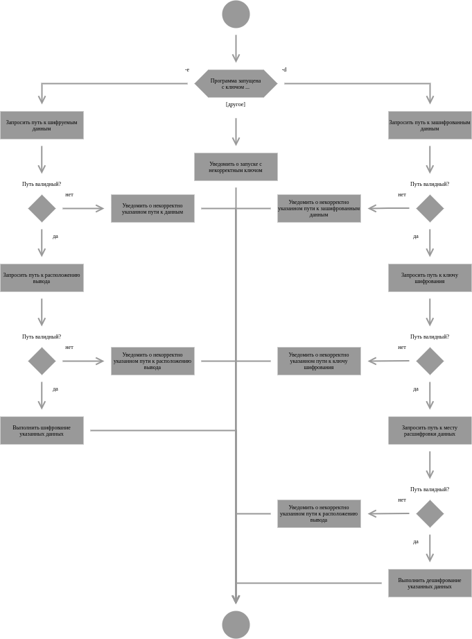
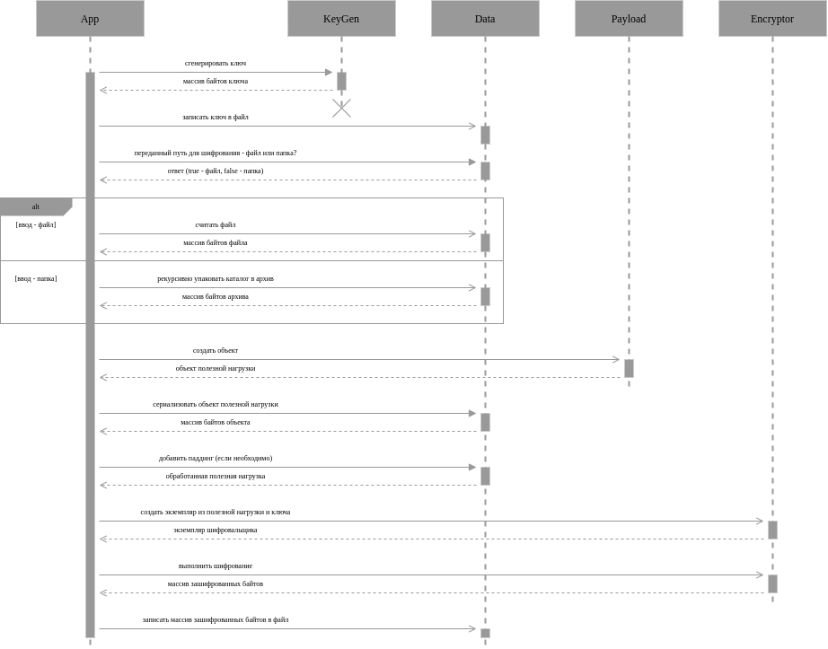
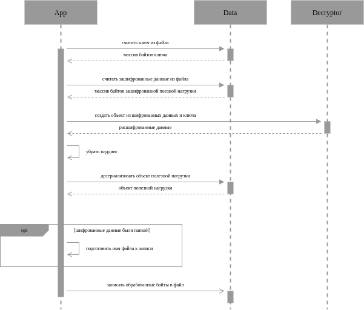

# magmacrypt

## 1. Теоретическая часть


***

## 2. Практическая часть

### 2.1. Общие сведения

Данная реализация на языке Java использует версию языка 11 и JDK версии 11. Для сборки приложения используется фреймворк Maven версии 3.6.3; для написания unit-тестов - JUnit версии 4.11.

Сборка и выполнение по умолчанию осуществляются на виртуальной машине с запущенным дистрибутивом Fedora Linux Server 35 (версия ядра - 5.15.10-200.fc35.x86_64).

Вывод команды `java --version` для среды сборки и выполнения по умолчанию:

```
openjdk 11.0.13 2021-10-19
OpenJDK Runtime Environment 18.9 (build 11.0.13+8)
OpenJDK 64-Bit Server VM 18.9 (build 11.0.13+8, mixed mode, sharing)
```

В качестве основных параметров сборки определены следующие свойства:
1. `groupId = ru.mirea.edu.magmacrypt` - для управления компиляцией исходников, также является основным пакетом приложения и используется в качестве соответствующего идентификатора;
2. `artefactId = magmacrypt` и `version = 1.0` - для генерации jar-архива приложения;
3. `mainClass = ru.mirea.edu.magmacrypt.App` - для определения расположения метода `main` (точки входа в приложение);

Структура файлов исходного кода выглядит следующим образом (вывод команды `tree`):

1. Каталог `src` - содержит файлы исходного кода с расширением `.java`:
   1. Каталог `main` - приложение, далее пакет `ru.mirea.edu.magmacrypt` (`gropuId`):
      1. Класс `App` - основной класс приложения;
      2. Пакет `auxiliary` - вспомогательные классы для работы с данными;
      3. Пакет `cipher` - классы, относящиеся к реализации алгоритма шифрования.
   2. Каталог `test` - unit-тесты, далее пакет `ru.mirea.edu.magmacrypt` (`gropuId`), содержащий класс `AppTest` для проверки работы алгоритма шифрования и взаимодействия с различными типами входных данных;
2. Каталог `target` (создается и наполняется при компиляции исходного кода - файлы `.class`, и сборке `jar`-файла):
   1. Каталог `classes`, далее пакет `ru.mirea.edu.magmacrypt` (`gropuId`)
   2. Каталог `test-classes`, далее пакет `ru.mirea.edu.magmacrypt` (`gropuId`)
   3. Файл `magmacrypt-1.0.jar` - собранное приложение;
3. Файл `pom.xml` - конфигурация сборки;
4. Файл `rebuild.sh` - скрипт очистки собранного решения и сборки нового;
5. Каталог `TEST_DATA` - набор данных, используемых для тестирования.

<div style="page-break-after: always;"></div>

### 2.2. Описание реализации

Приложение описывают следующие диаграммы классов:

>  
Рис. Х: Основной пакет

>  
Рис. Х: Пакет с реализацией алгоритма

>  
Рис. Х: Пакет со вспомогательными сущностями

>  
Рис. Х: Общая схема работы приложения

>  
Рис. Х: Процесс шифрования

>  
Рис. Х: Процесс дешифрования

Методы класса Algorithm:
1. `perform` - абстрактный метод, необходимый для реализации наследниками `Encryptor` и `Decryptor`  
   ```Java
   public abstract byte[] perform();
   ```
2. `encrypt` - используется классом `Encryptor` в реализации метода `perform`:
   1. Итеративно разделяет входные данные на блоки по 64 бита
   2. Для первых 31 раунда производится шифрование с заменой левой и правой частей блока
   ```Java
    protected byte[] encrypt(byte[] input, byte[] keySet) {
        byte[] output = Arrays.copyOf(input, input.length);

        for (int i = 0; i <= input.length - 8; i += 8) {
            for (int q = 0; q < 3; q++) {
                for (int w = 0; w < 8; w++) {
                    int roundKey = getRoundKey(w, keySet);
                    performRound(i, output, roundKey);
                }
            }
            for (int w = 7; w >= 0; w--) {
                int roundKey = getRoundKey(w, keySet);
                performRound(i, output, roundKey);
                if (w == 0) {
                    byte[] lastArray = new byte[8];
                    System.arraycopy(output, output.length - i - 8, lastArray, 4, 4);
                    System.arraycopy(output, output.length - i - 4, lastArray, 0, 4);
                    System.arraycopy(lastArray, 0, output, output.length - i - 8, 8);
                }
            }
        }

        return output;
    }
   ```
3. `decrypt` - используется классом `Decryptor` в реализации метода `perform` (процесс аналогичен шифрованию, но порядок раундовых ключей инвертирован):  
   ```Java
    protected byte[] decrypt(byte[] input, byte[] keySet) {
        byte[] output = Arrays.copyOf(input, input.length);
        int w;

        for (int i = 0; i <= input.length - 8; i += 8) {
            for (w = 0; w < 8; w++) {
                int roundKey = getRoundKey(w, keySet);
                performRound(i, output, roundKey);
            }
            for (int q = 0; q < 3; q++) {
                for (w = 7; w >= 0; w--) {
                    int roundKey = getRoundKey(w, keySet);
                    performRound(i, output, roundKey);
                }
                if (w == -1 && q == 2) {
                    byte[] lastArray = new byte[8];
                    System.arraycopy(output, output.length - i - 8, lastArray, 4, 4);
                    System.arraycopy(output, output.length - i - 4, lastArray, 0, 4);
                    System.arraycopy(lastArray, 0, output, output.length - i - 8, 8);
                }
            }
        }

        return output;
    }
   ```
4. `performRound` - выполняет изменения в рамках одного раунда шифрования:
   1. выполняет соответствующее преобразование в левой и правых частях текущего блока
   2. выполняет преобразование блока согласно таблице подстановок
   3. смещает получившийся результат на 11 двоичных разрядов
   ```Java
    private void performRound(int startIndex, byte[] input, int roundKey) {
            int n2 = input[input.length - startIndex - 1] << 24
                    | (input[input.length - startIndex - 2] & 0xFF) << 16
                    | (input[input.length - startIndex - 3] & 0xFF) << 8
                    | (input[input.length - startIndex - 4] & 0xFF);
            int n1 = input[input.length - startIndex - 5] << 24
                    | (input[input.length - startIndex - 6] & 0xFF) << 16
                    | (input[input.length - startIndex - 7] & 0xFF) << 8
                    | (input[input.length - startIndex - 8] & 0xFF);
            int s = ((n1 + roundKey) & 0xFFFFFFFF);

            s = substituteUsingSBox(s);
            s = shiftLeftBy11Ranks(s);
            s = s ^ n2;

            byte[] n1s = mergeArrays(n1, s);

            for (int j = 7; j >= 0; j--) {
                input[input.length - 1 - (startIndex + j)] = n1s[j];
            }
    }
   ```
5. `substituteUsingSBox` - выполняют замену блока согласно таблицы подстановок  
   ```Java
    private int substituteUsingSBox(int n) {
            int xTest = 0;

            for (int i = 0, j = 0; i <= 28; i += 4, j++) {
                xTest += (sBox[j][(byte) ((n >> i) & 0xF)]) << (i);
            }

            return xTest;
    }
   ```
6. `mergeArrays` - объединяет левую и правую части блока в рамках 1 раунда  
   ```Java
    private byte[] mergeArrays(int n1, int n2) {
        byte[] bytes = new byte[8];

        for (int j = 0; j < 4; j++) {
            bytes[j] = (byte) ((n1 >> 24 - (j * 8)) & 0xFF);
        }

        for (int j = 4; j < 8; j++) {
            bytes[j] = (byte) ((n2 >> 24 - (j * 8)) & 0xFF);
        }

        return bytes;
    }
   
   ```
7. `shiftLeftBy11Ranks` - операция сдвига четырехбайтного числа на 11 разрядов  
   ```Java
    private int shiftLeftBy11Ranks(int a) {
            int shift = 11;
            a = (a >>> (32 - shift)) | a << shift;
            return a;
    }
   ```
8. `getRoundKey` - получает текущий раундовый ключ по его номеру из исходного ключевой информации  
   ```Java
    private int getRoundKey(int w, byte[] keySet) {
            return keySet[w * 4 + 3] << 24
                    | (keySet[w * 4 + 2] & 0xFF) << 16
                    | (keySet[w * 4 + 1] & 0xFF) << 8
                    | (keySet[w * 4] & 0xFF);
    }
   ```

<div style="page-break-after: always;"></div>

### 2.3. Пример запуска

<div style="page-break-after: always;"></div>